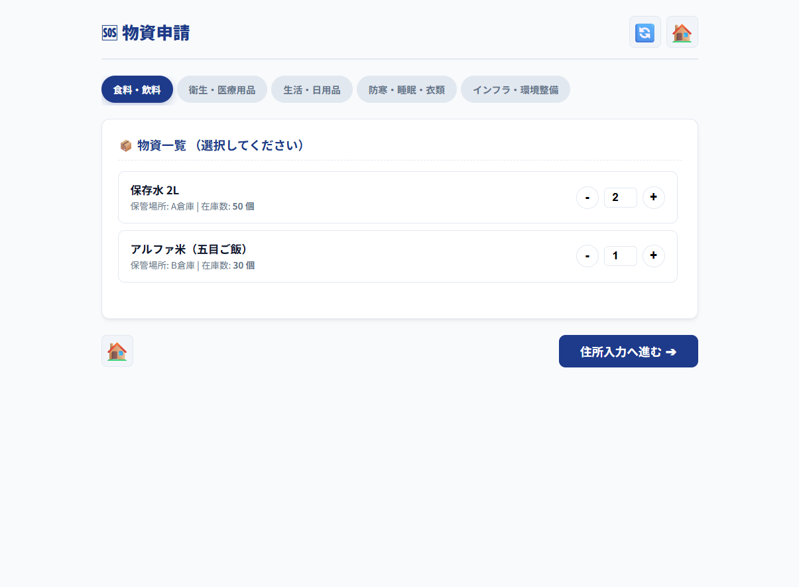
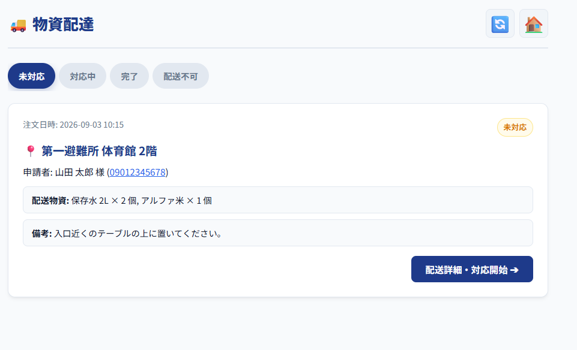
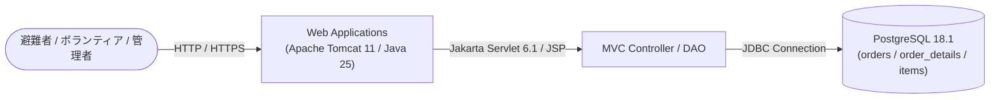

# アプリケーション「ラストワンマイル」

[](https://openjdk.org/)
[](https://tomcat.apache.org/)
[](https://www.postgresql.org/)
[](https://aws.amazon.com/)
[](https://ai.google.dev/)
[](https://www.eclipse.org/)
[](https://a5m2.mmatsubara.com/)
[](https://antigravity.google/)

避難所・支援先からの物資申請と、ボランティアによる配送対応、管理者による在庫・配送進捗管理を一元化するWebアプリケーションです。  
直感的なUIでの物資申請・リアルタイムな配送ステータス追跡、およびレスポンシブ（スマホ最適化）対応を備え、災害時や緊急支援時にも迅速かつ正確な物資共有を支援します。
> [!NOTE]  
> **本プロジェクトは、Java実習時に作成したコンテンツ（ポートフォリオ）です。**  
> * **開発期間**: 26日  (要件定義、PD、PG)
> * **開発規模**: 2.3Kstep  
> 
> Java実習の内容は以下よりご覧いただけます。  
> 👉 **[Java実習の内容はこちら](https://github.com/hadano-nobuyuki/ai-programming-training-portfolio)**  
> *(※別タブで開く場合は Ctrl + クリック / Cmd + クリック 推奨)*

---

## 📑 目次
1. [💻 画面イメージ](#-画面イメージ)
2. [✨ 主な機能](#-主な機能)
3. [🧰 使用技術・開発環境](#-使用技術開発環境)
4. [📐 システム構成](#-システム構成)
5. [🌐 動作確認（デモ環境）](#-動作確認デモ環境)
6. [📖 要件定義書・画面設計書](#-要件定義書画面設計書)
7. [🛠️ ローカル環境での実行・セットアップ手順](#️-ローカル環境での実行セットアップ手順)
8. [💡 工夫した点](#-工夫した点)
9. [🧗 苦労した点・得られた教訓](#-苦労した点得られた教訓)

---

## 💻 画面イメージ

*(※ 掲載している画像はシステム画面の一部抜粋です。全画面イメージや詳細な画面フローは [要件定義書・画面設計書](#-要件定義書画面設計書) よりご覧いただけます)*

| 物資申請画面（利用者用）<br><sub></sub> | 物資配達画面（ボランティア用）<br><sub></sub> |
| :---: | :---: |
|  |  |
| ジャンル別タブ・数量コントロールによる直感的な物資申請 | 未対応・対応中・完了・配送不可ごとのリアルタイム進捗管理 |

---

## ✨ 主な機能

### 📦 1. 利用者向け機能（避難者・支援要請者）
* **物資申請機能**
  * **ジャンル別フィルタリング**: 食料・飲料・衛生用品・生活用品などのカテゴリタブ切り替え。
  * **直感的な数量入力**: `+` / `-` ボタンによる直感的な数量コントロール（入力保持対応）。
  * **お届け先・備考入力**: 避難所名などの住所、備考（コメント）を指定して一括申請。
  * **在庫連動チェック**: リアルタイムで在庫数を超過する申請を防ぐ自動バリデーション。
* **申請完了・注文番号発行機能**
  * 申請完了時に固有の「注文番号（6桁）」を発行・表示。
* **配送状況確認・照会機能**
  * 注文番号から、現在の対応状況（未対応 / 対応中 / 完了 / 配送不可）、配送予定物資の明細、配送者備考を閲覧。
* **申請取り消し（キャンセル）機能**
  * 配送ステータスが「未対応」の注文に限り、利用者自身で申請を取り消すことが可能（取り消し時に自動で在庫を還元）。

---

### 🚚 2. ボランティア向け機能（配達担当者）
* **物資配達（一覧・ステータス更新）機能**
  * **ステータス別タブ切り替え**: 「未対応」「対応中」「完了」「配送不可」の4つの状態別に案件を整理
  * **配達対応開始（未対応 ➔ 対応中）**: 配送を担当するボランティアが氏名を入力し、対応を開始。
  * **配達完了報告（対応中 ➔ 完了）**: 配送完了時の報告処理（注文明細・お届け先の確定）。
  * **配送不可報告（対応中 ➔ 配送不可）**: 道路遮断や不在等で配達不能となった場合の理由付き報告（自動で在庫を復元）。

---

### ⚙️️ 3. 管理者向け機能（システム管理者）
* **管理者認証（ログイン / ログアウト）機能**
  * パスワード認証による管理者専用エリアの保護。安全なセッション破棄および完了モーダル表示。
* **管理者物資一覧・在庫管理機能**
  * **登録物資の一覧表示**: 全物資のカテゴリ、品名、現在の在庫数、登録日時の一覧把握。
  * **物資の新規追加**: 新たな支援物資（カテゴリ・品名・初期在庫数）のシステム登録。
  * **物資情報の編集**: 品名やカテゴリ、在庫数の直接調整・修正。
  * **物資の削除**: 在庫切れや不要となった物資の削除（関連データ整合性を保つ安全削除）。
* **管理者配送一覧・全注文モニタリング機能**
  * **全ステータス一元管理**: 「すべて」タブを含む、システム全体の全注文データの検索・閲覧。
  * **注文強制キャンセル・削除**: 誤申請や重複申請など、管理者が任意の注文データを安全に削除・取り消し処理。

---

## 🧰 使用技術・開発環境

| カテゴリ | 技術スタック / バージョン |
| :--- | :--- |
| **開発期間** | 26日 |
| **開発規模** | 2.3Kstep |
| **言語・ランタイム** | Java 25 (OpenJDK) |
| **Webコンテナ / APサーバ** | Apache Tomcat 11 |
| **バックエンドフレームワーク** | Java (Servlet / JSP) |
| **データベース** | PostgreSQL 18.1（テーブル生成用 [DDL.sql](DDL.sql) を同梱） |
| **インフラ / ホスティング** | AWS (EC2) |
| **統合開発環境 (IDE)** | Eclipse |
| **DB管理・設計ツール** | A5:SQL Mk-2 |
| **開発支援（AI）** | Antigravity |

---

## 📐 システム構成



---

## 🌐 動作確認（デモ環境）

AWS上にデプロイしており、実際に動作をご確認いただけます。

👉 **[「ミセス」デモサイトはこちら](http://13.193.142.78/yakusokun)**  
*(※別タブで開く場合は `Ctrl + クリック` / `Cmd + クリック` 推奨)*

> **テスト用ログイン情報**  
> * **ID**: `管理者A`  
> * **パスワード**: `1234`

---

## 📖 要件定義書・画面設計書

👉 **[Web版 要件定義書・画面設計書はこちら（GitHub Pages）](https://hadano-nobuyuki.github.io/project/)**  
*(※リンクを別タブで開く場合は `Ctrl + クリック`（Macは `Cmd + クリック`）してください)*  
*(※システム仕様・各画面イメージ・業務フローの詳細をWebページ形式でご覧いただけます)*

---

## 🛠️ ローカル環境での実行・セットアップ手順

ローカル環境で本プロジェクトを実行する場合は、以下の環境準備、データベースのセットアップ、APIキーの設定、およびデータベース接続設定が必要です。

### 1. 前提条件
* **Java**: JDK 25
* **Webコンテナ**: Apache Tomcat 11
* **データベース**: PostgreSQL 18.1
  * ※ プログラムを実行する際に必要な環境として、データベースのテーブル生成用DDL（[`DDL.sql`](DDL.sql)）をプロジェクトルート直下に公開・同梱しています。

### 2. データベースの構築（テーブル生成用DDLの実行）
プログラムの実行に必要なテーブル群を生成するため、公開しているテーブル生成用DDL（[`DDL.sql`](DDL.sql)）を実行してください。

1. PostgreSQLにて任意のデータベース（例: `misesu`）を作成します。
2. 作成したデータベースに対して、プロジェクトルート直下の [`DDL.sql`](DDL.sql) を実行してテーブルを作成します。  
   *(※ A5:SQL Mk-2、pgAdmin、または `psql` コマンドライン等から実行可能です)*

### 4. データベース設定ファイルの作成
セキュリティ保護のため設定ファイル自体はリポジトリ管理外となっています。  
`/src/main/java/` 配下に `db.properties` を作成し、ご自身のローカルDB環境に合わせて接続情報を設定してください。

> **リポジトリ内に `db.properties.sample` を用意していますので、リネームしてご利用いただけます。**

#### `db.properties` の記述例
```properties
db.url=jdbc:postgresql://localhost:5432/データベース名
db.user=ユーザ名
db.password=パスワード
db.driver=org.postgresql.Driver
```

---

## 💡 工夫した点

### 1. プログラミングの効率化
* **Antigravity** にコーディングを実施させることで、開発効率を大幅に高めました。

　**アプローチ内容**:
  * 1.要件定義書からプログラム設計書を作成
  * 2.ER図・DDLの作成し、テーブルを作成
  * 3.要件定義書の作成
  * 4.コーディングでの予期せぬエラーを防ぐために指示書の作成
  * 5.（1・2・3・4）を基にAIにてコーディングを実施
  * AIが生成したプログラムを確認し、改善箇所を抽出して対策を実施  
    *(※ 着目した改善箇所：セキュリティ上のリスク、性能向上箇所の有無、レイアウトの配置場所)*
  * 6.コーディングした物を解析

### 2. 画面のレイアウト
* pngだけではボタンの配置や色、スマホの画面にした際でのズレが起きました。
　AIに尋ねスクリーンショットを使い画面での表示を行ないました。ですが、思っていたのとは違いエラーが起きた際ポッ　プアップではなく、画面の上の方にエラーメッセージが出るなど設計書とは違う動きをすることがありました。エラーのポ　ップアップを共通エラーにし、すべてをポップアップ表示にすることで解決しました。

---

## 🧗 苦労した点・気づいた点

### AIが生成するプログラムの品質確保
プログラム設計書の記載内容に曖昧な箇所や画面内でのズレがあると、生成されるプログラムに想定外のロジックが組み込まれる事象が多発しました。  
その都度プログラム設計書を修正し、AIにてプログラムの再生成を実施する作業を繰り返しました。

このチーム開発を行う際に気づいた点は
 1.**プログラム設計書はコーディングを行なうための元となる物なので曖昧だったり、画面内でのズレがあると想定外な物ができる。**
 2.AIにてコーディングした後にコードを修正するのではなく、プログラム設計書の修正をすることにより、後からの仕様変更などに役立てる事ができる。
 3.今日のタスク、明日やるタスクを明確にすることで、チームでの認識を合わせ修正箇所があってもいつでも後戻りできるようにしておくことが大事。